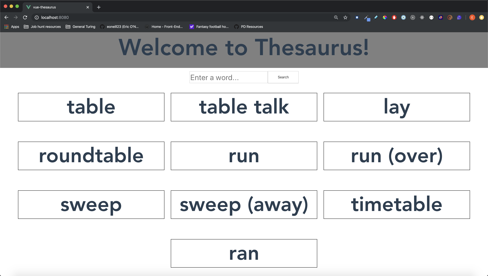

# Merriam-Webster Thesaurus Vue Challenge

## Overview
This project was designed as a take-home code challenge. The task was to build a Vue app that utilized the Merriam-Webster API to fetch and display synonyms for words that a user inputs. Those synonyms are then displayed on the page. Users can then click on a displayed synonym to display that words synonyms.

## Set up
* Clone this repository down with `git clone`
* Install the necessary dependencies with `npm install`
* Start the local server with `npm run serve`
* Visit `localhost:8080` to view the app in your browser!

## Successes
This was my first exposure to using the Vue.js framework. Having built the majority of my projects in React, the logic of Vue was familiar as far as rendering components, passing props, etc. Learning Vue syntax for passing props, passing events instead of methods (like React), and styling with CSS directly in the component were all new and cool things to learn.

## Challenges
The biggest challenge in building this Vue application was learning the syntax. My React experience helped give me a foundation for how to transfer and display information, but having methods in a different object, data in a different object, passing props, and passing events were all new challenges for me. Additionally, list-rendering in Vue is different than it is in React with the v-for methods.

## Built with
* Vue.js
* CSS
* GitHub projects/issues for project management

## Extensions
* Deploying to Heroku (I tried deploying to Heroku, but got a number of errors that I could not parse through in time)
* Mobile-friendly

## Images
